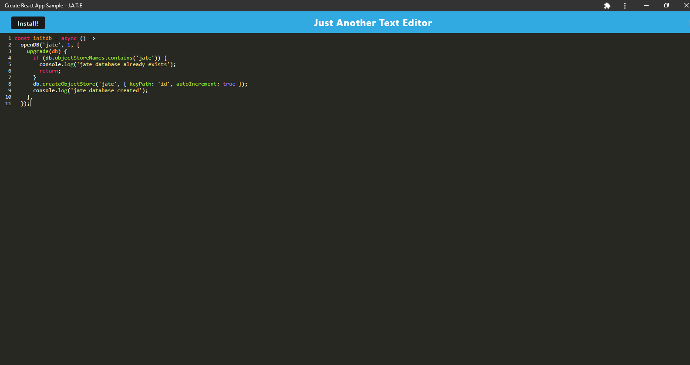

# JATE Text Editor PWA
## Description
In this project we were given code for a text editor app and had to add functionality to make it a true PWA, including the capability to install the app and use it offline.
## Technology Used
This app relies on Webpack to bundle the JavaScript and uses those plugins to generate an HTML file, the styling, the service worker and create a manifest file.  It also uses IndexedDB to store the data created, even if the app is closed or clicked away from.
## Link to Heroku Deployment
https://jate-pwa-sshack.herokuapp.com/
## Screenshot of Installed App

